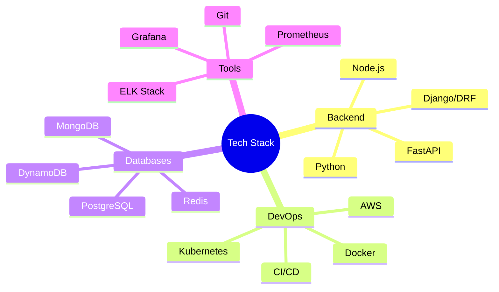

#  Hi there, I'm Ram Awasthi &nbsp;&nbsp;&nbsp;&nbsp;&nbsp;&nbsp;&nbsp;&nbsp;&nbsp;&nbsp;&nbsp;&nbsp;&nbsp;&nbsp;&nbsp;&nbsp;&nbsp;&nbsp;&nbsp;&nbsp;&nbsp;&nbsp;&nbsp;&nbsp;&nbsp;&nbsp;&nbsp;&nbsp;&nbsp;&nbsp;&nbsp;&nbsp;&nbsp;&nbsp;&nbsp;&nbsp;&nbsp;&nbsp;&nbsp;&nbsp;&nbsp;&nbsp;&nbsp;&nbsp;&nbsp;&nbsp;&nbsp;&nbsp;&nbsp;&nbsp;&nbsp;&nbsp;&nbsp;&nbsp;&nbsp;

<div align="center">
  
</div>

<div align="center">
  
</div>

##  About Me 
```typescript
const ramAwasthi = {
    role: "Engineering Manager @Flipped.ai AKA (GAIUS)",
    experience: "5+ years",
    achievements: ["Patent Holder", "60% Performance Boost", "1800+ Commits"],
    expertise: ["Backend Development", "DevOps", "System Architecture", "Team Leadership"],
    currentFocus: "Building AI-powered recruitment solutions",
    passion: "Transforming ideas into scalable solutions"
};
```

<div style="display: flex; align-items: center; justify-content: space-between;">
  <div style="flex: 2; padding-right: 20px;">
    <h3>🎯 Current Focus</h3>
    
    • Building next-gen AI recruitment solutions
    • Scaling serverless and microservices architecture
    • Mentoring and growing engineering teams
    • Optimizing system performance
  </div>
</div>

##  My Contribution Graph


## 🏆 Milestones
<div align="center">
  
| Year | Achievement | Impact |
|------|------------|---------|
| 2024 | 🏅 Engineering Manager | Leading team of talented engineers |
| 2023 | 🎯 Patent Granted | AI-based Resume Analysis System |
| 2023 | ⚡ Performance Boost | 60% improvement in system efficiency |
| 2022 | 🎉 Backend Lead | Spearheaded major architectural changes |
| 2021 | 🚀 Full Stack Developer | Developed core platform features |

</div>

## ✨ Professional Impact & Achievements

<div align="center">
  <table>
    <tr>
      <td width="50%">
        <h3 align="center">Technical Leadership</h3>
        <p align="center">
          
          <br><br>
          • Led migration to Dockerized DRF<br>
          • Achieved 60% performance boost<br>
          • Managing engineering team<br>
          • Established CI/CD practices
        </p>
      </td>
      <td width="50%">
        <h3 align="center">Innovation</h3>
        <p align="center">
          
          <br><br>
          • Patent: AI-based Resume Analysis<br>
          • AI-powered recruitment platform<br>
          • Automated assessment systems<br>
          • Scalable microservices architecture
        </p>
      </td>
    </tr>
  </table>
</div>

## 🛠️ Tech Stack

### Core Technologies


### Languages & Frameworks


### Cloud & DevOps


### Databases & Tools


## 📊 Contribution Insights

<div align="center">
  <!-- Yearly Contribution Selector -->
  <div>
    <a href="https://github.com/ramg-awasthi?tab=overview&from=2024-01-01&to=2024-12-31">
      
    </a>
    <a href="https://github.com/ramg-awasthi?tab=overview&from=2023-01-01&to=2023-12-31">
      
    </a>
    <a href="https://github.com/ramg-awasthi?tab=overview&from=2022-01-01&to=2022-12-31">
      
    </a>
    <a href="https://github.com/ramg-awasthi?tab=overview&from=2021-01-01&to=2021-12-31">
    
  </a>
  </div>
  
  <!-- Contribution Graphs -->
  
  
  <div style="display: flex; justify-content: space-between; margin-top: 20px;">
    
    
  </div>
</div>

### 🌟 Contribution Highlights
<div align="center">
  
</div>

### 🔥 Top Repositories
```javascript
const topRepos = {
    "flipped_dockerized_drf_apis": {
        commits: 1786,
        description: "Core backend APIs with Django REST Framework",
        highlights: ["Microservices", "Docker", "AWS"]
    },
    "Flipped_IITM_Backend": {
        commits: 82,
        description: "Backend system for IITM platform",
        highlights: ["API Integration", "Scalability"]
    }
};
```

##  Let's Connect

<div align="center">
  
[](https://linkedin.com/in/ram-awasthi)
[](https://instagram.com/ramg_awasthi)
[](https://x.com/ramg_awasthi)
[](https://discord.gg/ramgawasthi)
[](https://facebook.com/ramgawasthii)

</div>

---

<div align="center">
  
</div>
